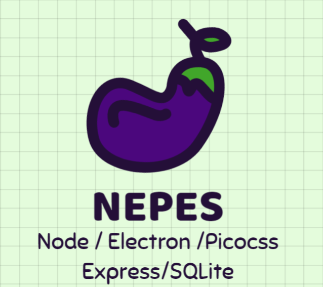

# NEPES Stack-Template

## Tecnologias empleadas:

---

### Core

### Frontend

### Backend

---

## Notas

- Express puede solucionar el tema de las llamadas, creo que se podria usar como base de datos local, pero tengo mis dudas... me permite crear metodos, pero necesito investigar mas...

- Knex tampoco me queda claro para que se usa, lo he visto en videos para configurar la base de datos de sqlite, pero sigo sin entenderlo bien

- El tema de la base de datos local se puede solucionar con SQLite. hay que pasar a implementarlo.

- El tema de comunicacion entre render y Main ya me queda calro, funciona con callback, asi maneja us asincronia, se en algun punto dentro de estas llamadas hay mas asyncronia hay que manejarlas por separado.
